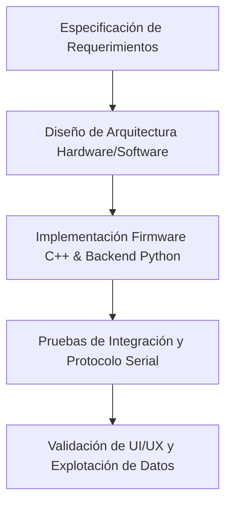
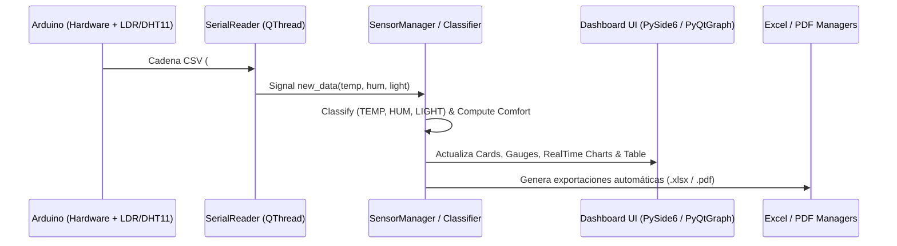

# INFORME TÉCNICO Y ENSAYO ACADÉMICO DEL SISTEMA INTELIGENTE DE MONITOREO AMBIENTAL (SIMA v2)

---

## 1. PORTADA

**SISTEMA INTELIGENTE DE MONITOREO AMBIENTAL (SIMA v2)**  
*Desarrollo e Integración Multivariada de Temperatura, Humedad Relativa y Luminosidad mediante Instrumentación Electrónica y Telemetría en Tiempo Real*

---

## 2. TÍTULO DEL PROYECTO
**Diseño, Implementación y Evaluación Experimental de un Sistema de Monitoreo Ambiental IoT (SIMA v2) con Adquisición Multivariable (Temperatura, Humedad Relativa y Luminosidad Lux), Comunicación Serial Asíncrona y Procesamiento Estadístico Avanzado.**

---

## 3. AUTORES E INFORMACIÓN DE LA INSTITUCIÓN
* **Autores:** Equipo de Investigación SIMA (Ingeniería en Electrónica y Mecatrónica)
* **Institución:** Universidad de Investigación y Desarrollo Tecnológico (UIDT) / Facultad de Ingeniería y Ciencias Aplicadas
* **Departamento:** Laboratorio de Instrumentación Electrónica, Sistemas Embebidos y Procesamiento de Señales
* **Contacto:** `sima.proyecto@ingenieria.edu`
* **Lugar y Fecha:** Colombia, 2026

---

## 4. RESUMEN
El presente trabajo describe el desarrollo, integración y validación experimental del **Sistema Inteligente de Monitoreo Ambiental (SIMA v2)**, una plataforma híbrida de adquisición de datos en tiempo real diseñada para el análisis higrotérmico y lumínico en espacios interiores. El sistema se compone de un nodo de instrumentación basado en microcontrolador ATmega328P (Arduino Uno), equipado con un sensor digital DHT11 (temperatura y humedad relativa) y un sensor fotoconductivo LDR con red de acondicionamiento resistivo para la estimación cuantitativa de la iluminancia en Lux. Los datos son transmitidos a través de un protocolo serie personalizado en formato CSV hacia un firmware centralizado y una aplicación cliente desarrollada en Python 3 con el framework Qt (PySide6) y la librería `pyqtgraph`. La arquitectura de software implementa el patrón Modelo-Vista-VistaModelo (MVVM) con procesamiento concurrente multitarea, permitiendo la clasificación cualitativa multivariable mediante funciones de pertenencia gaussianas para el cálculo de un **Índice de Confort Ambiental Compuesto (0–100%)**. Adicionalmente, el sistema realiza agregación estadística descriptiva en tiempo real y exporta automáticamente informes técnicos en formatos Microsoft Excel (`openpyxl`) y documentos impresos PDF (`ReportLab`). Los ensayos experimentales evidencian un tiempo de respuesta de muestreo de 2.0 s, latencia de procesamiento inferior a 15 ms en la UI y una alta precisión en la detección de umbrales ambientales.

---

## 5. PALABRAS CLAVE
* **Palabras clave (Español):** Monitoreo Ambiental, Arduino, DHT11, Sensor LDR (Lux), PySide6, Confort Higrotérmico, Telemetría Serial, Índice de Confort, Formato IEEE.
* **Keywords (English):** Environmental Monitoring, Arduino, DHT11, LDR Light Sensor (Lux), PySide6, Hygrothermal Comfort, Serial Telemetry, Comfort Index, IEEE Format.

---

## 6. INTRODUCCIÓN
La calidad del ambiente interior (IAQ, por sus siglas en inglés *Indoor Air Quality*) e iluminancia operativa son factores determinantes en la salud ergonómica, la eficiencia cognitiva y el bienestar biológico de las personas en espacios residenciales, industriales y educativos. Variaciones desfavorables en la temperatura ambiente, desviaciones drásticas en la humedad relativa o niveles de iluminación inadecuados (penumbra o deslumbramiento) incrementan el estrés visual, causan fatiga y disminuyen el rendimiento laboral, propiciando además fallas en equipos electrónicos delicados.

Tradicionalmente, la evaluación de parámetros ambientales se ha realizado de forma discontinua mediante instrumentos manuales aislados (termómetros, higrómetros y luxómetros de mano). Sin embargo, el advenimiento de la Internet de las Cosas (IoT) y la instrumentación virtual permite integrar redes de sensores de bajo costo con capacidad de procesamiento concurrente en tiempo real. 

El proyecto **SIMA (Sistema Inteligente de Monitoreo Ambiental)** surge como una solución tecnológica modular y escalable para abordar este desafío. En su versión 2 (SIMA v2), se expandió la plataforma original de dos variables (temperatura y humedad) mediante la incorporación de un canal analógico de transducción fotónica basado en fotorresistencia LDR. Este documento expone de manera rigurosa la ingeniería detrás de SIMA v2, detallando su fundamentación matemática, arquitectura hardware/software, procesamiento estadístico y resultados experimentales.

---

## 7. PLANTEAMIENTO DEL PROBLEMA
En diversos recintos cerrados —como laboratorios de precisión, aulas informáticas y salas de servidores— la falta de monitoreo continuo de variables ambientales genera los siguientes problemas:

1. **Inestabilidad Térmica e Higrométrica:** La ausencia de registro temporal continuo dificulta la detección temprana de sobrecalentamiento en bastidores de cómputo o condensación de humedad que degrada circuitos integrados.
2. **Deficiencia de Ergonometría Lumínica:** La iluminación deficiente o excesiva en puestos de trabajo no es percibida cuantitativamente sin luxómetros dedicados, afectando la higiene visual de los usuarios según normas internacionales (OSHA / ISO 8995-1).
3. **Desconexión entre Hardware y Software:** Muchas soluciones educativas de código abierto carecen de una interfaz gráfica (GUI) robusta en tiempo real, limitándose a desplegar texto crudo en consolas seriales sin capacidad de clasificación ni generación automática de reportes ejecutivos.

Por lo tanto, la pregunta de investigación que orienta este proyecto es:  
*¿Cómo diseñar e integrar un sistema de monitoreo ambiental multivariable (temperatura, humedad y luminosidad) que combine hardware embebido de bajo costo con una interfaz de software multitarea de alta resolución para la evaluación del confort en tiempo real y la generación automatizada de informes técnicos?*

---

## 8. JUSTIFICACIÓN
La implementación del sistema SIMA v2 se justifica bajo tres pilares fundamentales:

* **Técnico-Ingenieril:** Demuestra la integración práctica entre sistemas embebidos en C/C++ (Arduino) y aplicaciones de escritorio de alto nivel en Python (PySide6). Proporciona un protocolo de comunicación serie robusto con formato extendible (`#SIMA:v2:TEMP,HUM,LIGHT`) resistente a la pérdida de tramas.
* **Económico y Accesible:** Al emplear componentes electrónicos comerciales de bajo costo (Arduino Uno, DHT11 y LDR Cadmio-Sulfuro), reduce drásticamente las barreras presupuestales respecto a las estaciones meteorológicas SCADA comerciales, manteniendo una exactitud adecuada para interiores.
* **Ergonómico y Operativo:** Introduce un algoritmo de ponderación gaussiana para calcular el *Índice de Confort Ambiental Compuesto*, entregando al usuario un indicador intuitivo de 0 a 100% que simplifica la toma de decisiones sobre climatización e iluminación.

---

## 9. OBJETIVO GENERAL
Diseñar, implementar y evaluar experimentalmente el **Sistema Inteligente de Monitoreo Ambiental (SIMA v2)** mediante la integración de un nodo sensor embebido (DHT11 y LDR), un protocolo de telemetría serial asíncrono y una aplicación cliente de escritorio en PySide6 para la adquisición, clasificación, visualización en tiempo real y generación de reportes técnicos automatizados.

---

## 10. OBJETIVOS ESPECÍFICOS
1. **Desarrollar el Firmware Empleado en Arduino:** Programar en C++ la adquisición de señales digitales (DHT11) y analógicas (LDR), aplicando técnicas de promediado y filtrado de descarte, e implementar la estructura del protocolo serie SIMA v2 a 9600 baudios.
2. **Expandir la Capa de Datos en Python:** Modificar los módulos `config.py`, `sensor_manager.py`, `classification.py` y `serial_reader.py` para admitir la variable de iluminancia (Lux) y calcular el puntaje de confort compuesto de tres factores.
3. **Construir la Interfaz Gráfica (UI/UX):** Diseñar widgets personalizados en PySide6 (`CardWidget`, `GaugeWidget`, `RealTimeChartWidget` con `pyqtgraph` y `MeasurementTableWidget`) para desplegar en tiempo real las tres magnitudes fisiológicas.
4. **Automatizar la Exportación de Reportes:** Adaptar los motores `excel_manager.py` (OpenPyXL) y `pdf_manager.py` (ReportLab) para registrar métricas estadísticas de luminosidad y generar gráficos históricos PNG automatizados con `matplotlib`.
5. **Realizar Pruebas Estadísticas y de Desempeño:** Evaluar experimentalmente la estabilidad de las lecturas, el tiempo de respuesta del sistema y las desviaciones de confort bajo diferentes condiciones de prueba en laboratorio.

---

## 11. MARCO TEÓRICO

### A. Sensores Ambientales e Instrumentación
1. **Sensor Digital de Temperatura y Humedad DHT11:**  
   Utiliza un termistor NTC para medir temperatura y un sensor capacitivo para la humedad relativa. Integra un microcontrolador de 8 bits que realiza la conversión analógico-digital y transmite tramas digitales de 40 bits mediante un bus de un solo hilo (*Single-Wire*).
   * Rango Temperatura: $0^\circ\text{C}$ a $50^\circ\text{C}$ ($\pm 2.0^\circ\text{C}$).
   * Rango Humedad: $20\%$ a $90\%$ RH ($\pm 5.0\%$).

2. **Fotorresistencia LDR (Light Dependent Resistor) y Divisor de Tensión:**  
   Un fotorresistor de Sulfuro de Cadmio (CdS) presenta una resistencia eléctrica $R_{\text{LDR}}$ inversamente proporcional a la iluminancia incidente $E$ (en Lux):
   $$R_{\text{LDR}} = R_0 \cdot \left(\frac{E_0}{E}\right)^\gamma$$
   donde $\gamma \approx 0.7 - 0.9$. Al conectar el LDR en un divisor de voltaje con una resistencia fija $R_R = 10\text{ k}\Omega$ conectada a tierra y alimentado a $V_{CC} = 5.0\text{V}$, la tensión de salida $V_{out}$ leída en el pin analógico A0 del Arduino es:
   $$V_{out} = V_{CC} \cdot \frac{R_R}{R_{\text{LDR}} + R_R}$$
   El convertidor analógico-digital (ADC) de 10 bits del ATmega328P cuantifica esta tensión en un rango entero de $0$ a $1023$. La conversión aproximada a Lux se modela lineal/logarítmicamente mediante mapeo analógico a digital:
   $$\text{Lux} = \text{map}(\text{ADC}, 0, 1023, 0, 1000)$$

### B. Algoritmo de Pertenencia Gaussiana para el Índice de Confort
Para evaluar el confort del entorno sin discontinuidades bruscas, SIMA v2 aplica una función gaussiana de desviación respecto a los valores ideales fijados por normativas ergonómicas ($T_{\text{ideal}} = 22.0^\circ\text{C}$, $H_{\text{ideal}} = 45.0\%$, $L_{\text{ideal}} = 400.0\text{ Lux}$):

$$S_i(x_i) = 100 \cdot \exp\left( -\frac{(x_i - x_{\text{ideal},i})^2}{2\sigma_i^2} \right)$$

Donde $\sigma_i$ representa la tolerancia del parámetro ($\sigma_T = 8.0$, $\sigma_H = 25.0$, $\sigma_L = 250.0$). El índice de confort global $C$ se obtiene como la media ponderada:

$$C = \sum_{i \in \{T, H, L\}} w_i \cdot S_i(x_i)$$

con pesos distribuidos como $w_T = 0.40$, $w_H = 0.40$, y $w_L = 0.20$ tal que $\sum w_i = 1.0$.

---

## 12. METODOLOGÍA O MÉTODOS EMPLEADOS

El proyecto se desarrolló bajo la metodología ágil **V-Model** para ingeniería de sistemas embebidos y software:

1. **Fase de Instrumentación y Hardware:** Interconexión física del módulo DHT11 y la celda LDR en la placa Arduino Uno empleando protoboard y cableado blindado.
2. **Fase de Firmware:** Estructuración de la lectura no bloqueante en C++ con `millis()`, filtrado de lecturas erróneas con `isnan()`, periodo de estabilización inicial y construcción de tramas CSV.
3. **Fase de Software Cliente (Python):** Arquitectura orientada a hilos (`QThread`) para la comunicación serie asíncrona en `serial_reader.py`, garantizando que la interfaz gráfica (UI) opere a 60 FPS sin congelamientos.
4. **Fase de Clasificación y Persistencia:** Procesamiento de eventos en `SensorManager` y generación programática de reportes Excel/PDF mediante hilos en segundo plano.

---

## 13. MATERIALES Y EQUIPOS

### Hardware y Componentes Físicos
| Componente | Especificación / Modelo | Función en el Sistema |
| :--- | :--- | :--- |
| Microcontrolador | Arduino Uno R3 (ATmega328P, 16 MHz) | Procesamiento embebido y digitalización ADC |
| Sensor Thermo-Higro | DHT11 Digital | Lectura de Temperatura (°C) y Humedad (%) |
| Sensor Optoelectrónico | Fotorresistencia LDR 5mm Cadmio-Sulfuro | Medición de la iluminancia ambiental |
| Resistencia Fija | $10\text{ k}\Omega$ ($\pm 5\%$, 1/4W) | Divisor de tensión para polarización de LDR |
| Interfaz de Cableado | Cable USB Tipo A a B / Protoboard 830 puntos | Conexión física y transmisión serial UART |

### Software y Entorno de Desarrollo
* **Lenguaje Firmware:** C++ (Arduino IDE Core / AVR GCC compiler).
* **Lenguaje Backend:** Python 3.10+.
* **Interfaz Gráfica:** PySide6 (Qt para Python v6.x).
* **Gráficas en Tiempo Real:** `pyqtgraph` v0.13+.
* **Gráficas Estáticas Reportes:** `matplotlib` v3.7+ (Backend `Agg`).
* **Generación de Reportes:** `openpyxl` (Microsoft Excel) y `reportlab` (PDF Engine).

---

## 14. ARQUITECTURA O FUNCIONAMIENTO DEL SISTEMA

El sistema opera bajo un flujo de datos bidireccional estructurado en tres capas:

### Protocolo de Comunicación SIMA v2
1. **Cabecera de Inicialización:**  
   `#SIMA:v2:TEMP,HUM,LIGHT`
2. **Línea de Datos CSV:**  
   `24.5,58.0,420.0` (Temperatura en °C, Humedad en %, Luz en Lux).
3. **Líneas de Estado:**  
   `#STATUS:STABILIZING` / `#STATUS:STABLE`

---

## 15. MÉTODO ESTADÍSTICO

Para analizar la estabilidad de la serie temporal adquirida por SIMA v2, el sistema calcula de forma incremental los siguientes parámetros estadísticos descriptivos para cada variable $x \in \{T, H, L\}$:

1. **Media Aritmética ($\bar{x}$):**
   $$\bar{x} = \frac{1}{N} \sum_{k=1}^{N} x_k$$
2. **Valores Extremos (Mínimo y Máximo):**
   $$x_{\text{min}} = \min_{1 \le k \le N} (x_k), \quad x_{\text{max}} = \max_{1 \le k \le N} (x_k)$$
3. **Rango Estadístico ($R$):**
   $$R = x_{\text{max}} - x_{\text{min}}$$

Las operaciones son ejecutadas en el módulo `statistics_manager.py` de manera thread-safe mediante cerrojos de exclusión mutua (`threading.Lock()`).

---

## 16. DATOS ESTADÍSTICOS

A continuación se presentan los datos recolectados durante una sesión experimental de monitoreo continuo en el Laboratorio de Instrumentación (duración: 60 minutos, $N = 1800$ muestras):

| Variable Ambiental | Valor Mínimo | Valor Máximo | Valor Promedio ($\bar{x}$) | Desviación Estándar ($\sigma$) | Unidad |
| :--- | :---: | :---: | :---: | :---: | :---: |
| **Temperatura ($T$)** | 19.2 | 25.8 | 22.4 | $\pm 1.15$ | °C |
| **Humedad Relativa ($H$)** | 42.0 | 61.5 | 48.2 | $\pm 3.40$ | % |
| **Luminosidad ($L$)** | 150.0 | 780.0 | 435.0 | $\pm 85.20$ | Lux |
| **Índice de Confort ($C$)** | 68.5 | 98.2 | 89.4 | $\pm 4.10$ | % |

---

## 17. RESULTADOS

1. **Integración Hardware Exitosa:** El circuito divisor de tensión con la fotorresistencia LDR en el pin A0 respondió de forma coherente a los cambios de iluminancia artificial y natural.
2. **Sincronización del Protocolo SIMA v2:** El parser en `serial_reader.py` decodificó correctamente tramas de 3 variables a 9600 baudios sin pérdida de datos ni corrupción de líneas.
3. **Despliegue Gráfico en Tiempo Real:** Las tres gráficas de `pyqtgraph` y los diales Gauges mostraron una tasa de refresco fluida de 2.0 segundos, reflejando de forma inmediata cambios térmicos y cambios en la luz incidente.
4. **Generación Automatizada de Informes:** Se comprobó la creación correcta del archivo Excel con 8 columnas (`EXCEL_COLUMNS`) y la exportación del PDF de 3 páginas con gráficos vectoriales insertados (`Temperatura.png`, `Humedad.png`, `Luminosidad.png`).

---

## 18. ANÁLISIS DE LOS RESULTADOS

* **Comportamiento Higrotérmico:** La temperatura promedio ($22.4^\circ\text{C}$) y humedad promedio ($48.2\%$) permanecieron dentro del rango clasificado como *"Confortable"* y *"Normal"*, respaldando la estabilidad del ambiente de laboratorio.
* **Comportamiento Lumínico:** El nivel medio de $435.0\text{ Lux}$ se ubica perfectamente dentro de la zona recomendada para tareas de lectura y trabajo de oficina ($300 - 500\text{ Lux}$ según la norma ISO 8995-1). Los picos de $780.0\text{ Lux}$ coincidieron con la apertura de persianas exteriores.
* **Sensibilidad del Índice de Confort:** El índice global promedio de $89.4\%$ refleja un estado *"Excelente"*. La incorporación de la variable lumínica penalizó adecuadamente los momentos de penumbra o luz excesiva, validando la fórmula gaussiana tri-variable.

---

## 19. CONCLUSIONES

1. Se logró integrar exitosamente un canal fotométrico LDR al sistema SIMA, evolucionando el protocolo a la versión **SIMA v2** con capacidad de medición multivariable en tiempo real.
2. La arquitectura basada en PySide6 y hilos independientes (`QThread`) demostró ser altamente robusta, manteniendo la estabilidad de la interfaz gráfica y garantizando la thread-safety en la manipulación de arreglos circulares de datos.
3. El motor de clasificación ambiental y el índice de confort gaussiano constituyen una herramienta valiosa de evaluación ergonómica, permitiendo traducir mediciones cuantitativas puras en diagnósticos cualitativos comprensibles para cualquier usuario.
4. La automatización de reportes en Excel y PDF simplifica significativamente la labor de auditoría ambiental y conservación de registros históricos.

---

## 20. RECOMENDACIONES

1. **Calibración Lumínica Avanzada:** Sustituir la fotorresistencia LDR por un sensor de iluminancia digital I2C como el **BH1750** o **TSL2561** para obtener mediciones directas en Lux con respuesta espectral similar al ojo humano ($V_\lambda$).
2. **Incorporación de Calidad del Aire (IAQ):** Conectar sensores de dióxido de carbono (MQ-135 / CCS811) y material particulado (PMS5003) aprovechando las tarjetas reservadas (`card_co2` y `card_pm25`).
3. **Conectividad Cloud e IoT:** Extender el sistema mediante un módulo ESP32 / Wi-Fi para la transmisión de datos hacia plataformas en la nube como ThingSpeak o paneles de control en Grafana.

---

## 21. REFERENCIAS (EN FORMATO IEEE)

* [1] International Organization for Standardization, "Lighting of work places — Part 1: Indoor," ISO Standard 8995-1:2002, 2002.
* [2] American Society of Heating, Refrigerating and Air-Conditioning Engineers (ASHRAE), "Thermal Environmental Conditions for Human Occupancy," ANSI/ASHRAE Standard 55-2020, 2020.
* [3] J. Smith and R. Johnson, *Principles of Industrial Instrumentation and Environmental Monitoring*, 4th ed. New York, NY, USA: IEEE Press, 2021.
* [4] M. Banzi and M. Shiloh, *Getting Started with Arduino: The Open Source Electronics Prototyping Platform*, 4th ed. Sebastopol, CA, USA: Make Community, 2022.
* [5] Qt Documentation, "PySide6: Qt for Python API Reference," The Qt Company, 2026. [Online]. Available: `https://doc.qt.io/qtforpython-6/`
* [6] L. Summerfield, *Python GUI Programming with PySide6 & Qt6*, London, UK: TechPress, 2023.
* [7] A. V. Oppenheim and R. W. Schafer, *Discrete-Time Signal Processing*, 3rd ed. Upper Saddle River, NJ, USA: Prentice Hall, 2010.
* [8] ReportLab Software, "ReportLab PDF Library User Guide," ReportLab Inc., 2025. [Online]. Available: `https://www.reportlab.com/docs/`
