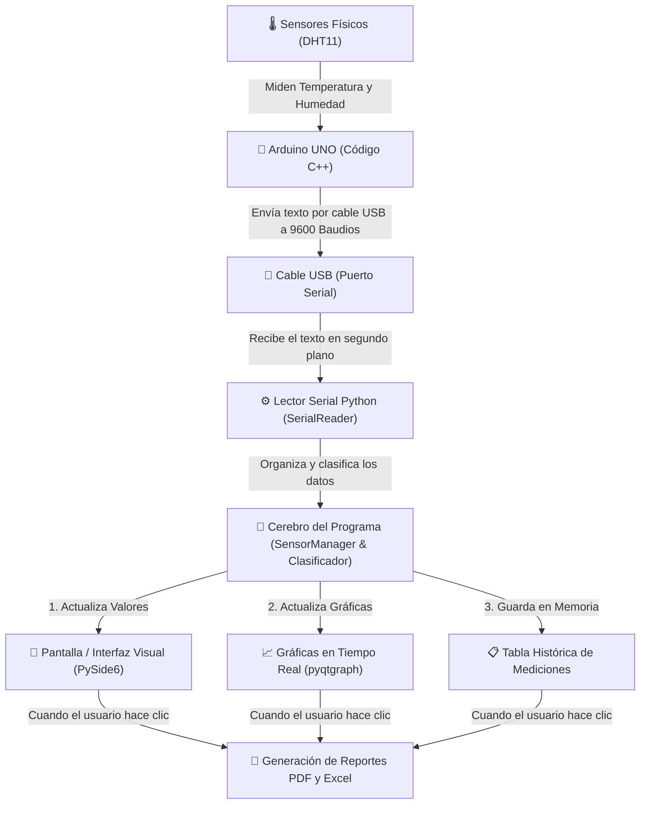

# 📢 SIMA — Guía de Presentación y Explicación del Proyecto

> **Sistema Inteligente de Monitoreo Ambiental (SIMA)**  
> *Documento amigable de explicación, arquitectura simplificada y guión de exposición para público general o evaluación.*

---

## 🌟 1. ¿Qué es la esencia de SIMA y para qué sirve?

**SIMA** (Sistema Inteligente de Monitoreo Ambiental) es una estación de control en tiempo real —estilo tablero industrial o centro de control— que mide las condiciones del aire y del clima en un espacio (como una oficina, laboratorio o sala de servidores).

### ¿Qué hace esencialmente?
1. **Mide**: Captura la **Temperatura** y la **Humedad** del ambiente a través de sensores físicos.
2. **Analiza e Interpreta**: No solo muestra números; evalúa automáticamente si el ambiente es **Fresco, Confortable, Cálido o Peligroso**, y calcula un **Índice de Confort Ambiental** (de 0 a 100%).
3. **Muestra en Tiempo Real**: Dibuja en una pantalla moderna relojes circulares (gauges), tarjetas dinámicas de colores y gráficas en movimiento.
4. **Genera Reportes Automáticos**: Con un solo clic, crea informes ejecutivos en formato **PDF** e **historiales en Excel** listos para imprimir o enviar.

---

## 💻 2. Lenguajes de Programación Utilizados

El proyecto utiliza **dos lenguajes de programación**, cada uno con un rol muy claro:

```
+------------------------------------+        +------------------------------------+
|          ARDUINO (C++)             |        |           PYTHON 3                 |
|                                    |        |                                    |
| - Es el lenguaje del microchip.    |        | - Es el lenguaje de la computadora. |
| - Muy rápido y directo al hardware.|  --->  | - Procesa los datos de forma       |
| - Lee la electricidad de los       |        |   inteligente.                     |
|   sensores cada 2 segundos.        |        | - Construye la interfaz visual.    |
| - Envía los datos por el cable USB.|        | - Genera los archivos PDF y Excel. |
+------------------------------------+        +------------------------------------+
```

- **C++ (Firmware Arduino)**: Utilizado para programar el microcontrolador **Arduino UNO**. Es ligero, veloz y se encarga de tomar la lectura eléctrica pura de los sensores sin fallar.
- **Python 3 (Software Computadora)**: Utilizado para desarrollar toda la aplicación de escritorio. Python fue elegido por su enorme potencia para procesar datos, crear interfaces gráficas modernas y compilar documentos.

---

## 🔌 3. ¿Cómo se Conecta y cómo Transmite los Datos?

### La Conexión Física:
- El sensor **DHT11** está conectado al **Arduino UNO** a través de cables de datos y energía (5 Voltios y Tierra).
- El **Arduino UNO** se conecta a la computadora mediante un **cable USB estándar**.

### La Transmisión de Datos (El Viaje de la Información):
1. **Cada 2 segundos**, el Arduino toma una lectura del sensor.
2. Formatea los datos como un texto plano simple separado por comas (formato **CSV**).  
   *Ejemplo de lo que viaja por el cable USB:*  
   `"24.5,58.0,400.0"` *(Significa: 24.5 °C de Temperatura, 58% de Humedad y 400 Lux de Luz)*.
3. Si el Arduino detecta un problema o se está iniciando, envía avisos especiales que empiezan con `#`:  
   - `#STATUS:READY` *(El sistema está encendido y listo)*.  
   - `#ERROR:DHT11_READ_FAIL` *(Un cable se desconectó o el sensor falló)*.

---

## 📊 4. Diagrama de Flujo Sencillo e Ilustrativo

El siguiente diagrama explica de manera simple todo el recorrido del dato desde el aire hasta la pantalla y el archivo final:



---

## 🧠 5. ¿Quién recibe la información y quién la organiza?

En la computadora (Python), el trabajo está dividido en **4 piezas clave**:

1. **El Receptor (`serial_reader.py`)**:
   - Es un **hilo de trabajo independiente** (`QThread`).
   - Escucha el cable USB constantemente en segundo plano. Esto evita que la pantalla se congele o se "pegue" mientras entran los datos.

2. **El Organizador de Memoria (`sensor_manager.py`)**:
   - Recibe la lectura y la guarda en una memoria circular (buffer).
   - Guarda las **últimas 100 lecturas** para dibujar las gráficas en vivo y conserva el registro completo de la sesión para los reportes.

3. **El Clasificador Inteligente (`classification.py`)**:
   - Toma los números y los traduce a significado humano:
     - Si la temperatura está entre **18 °C y 25 °C** ➔ Asigna **"Confort"** (Color Verde).
     - Si pasa de **30 °C** ➔ Asigna **"Muy Cálido"** (Color Rojo).
   - Calcula el **Índice de Confort Ambiental** (un puntaje global de 0 a 100%).

4. **El Motor Estadístico (`statistics_manager.py`)**:
   - Calcula automáticamente el valor **Mínimo, Máximo, Promedio y Desviación Estándar** de toda la sesión de monitoreo.

---

## 🖥️ 6. ¿Cómo funciona la Interfaz Visual (La Pantalla)?

La interfaz gráfica fue creada con **PySide6 (Qt para Python)**, el estándar profesional de la industria para aplicaciones de escritorio.

```
+-----------------------------------------------------------------------------------+
|  [Conectar Serial] [Pausar Tiempo] [Limpiar]        [Exportar Excel] [Generar PDF] |
+-----------------------------------------------------------------------------------+
|  +--------------------+  +--------------------+  +--------------------+           |
|  |  TEMPERATURA       |  |  HUMEDAD           |  |  CONFORT AMBIENTAL |           |
|  |  24.5 °C (Confort) |  |  58.0 % (Óptimo)   |  |  92% (Excelente)   | (CARDS)   |
|  +--------------------+  +--------------------+  +--------------------+           |
+-----------------------------------------------------------------------------------+
|  +---------------------------------+  +---------------------------------+         |
|  |  GAUGE TEMPERATURA (Reloj)      |  |  GAUGE HUMEDAD (Reloj)          | (GAUGES)|
|  +---------------------------------+  +---------------------------------+         |
+-----------------------------------------------------------------------------------+
|  +-----------------------------------------------------------------------------+  |
|  |  GRÁFICAS EN TIEMPO REAL (pyqtgraph) - Curvas de movimiento continuo        |  |
|  +-----------------------------------------------------------------------------+  |
+-----------------------------------------------------------------------------------+
|  +-----------------------------------------------------------------------------+  |
|  |  TABLA DE HISTORIAL (Registros por segundo con colores de estado)           |  |
|  +-----------------------------------------------------------------------------+  |
+-----------------------------------------------------------------------------------+
```

- **Tarjetas Dinámicas (Cards)**: Muestran el último valor medido con una etiqueta clara y un indicador de color (Verde, Azul, Naranja o Rojo).
- **Gauges Circulares (Relojes)**: Indicadores de aguja tipo tablero industrial dibujados con precisión matemática.
- **Gráficas Vectoriales (`pyqtgraph`)**: Muestran la evolución de la temperatura y humedad en el tiempo de forma fluida a 60 fotogramas por segundo.
- **Tabla Histórica**: Una lista deslizable que agrega cada nueva medición con su estampa de tiempo exacta.

---

## 📄 7. ¿Cómo se generan los archivos PDF y Excel?

Cuando el usuario hace clic en los botones de exportación, el sistema activa dos módulos especializados:

### 📗 Exportación a Excel (`excel_manager.py`)
- Utiliza la librería `openpyxl`.
- Crea un libro de trabajo completo sin necesidad de tener instalado Microsoft Excel.
- Genera **dos hojas**:
  1. **Hoja Resumen**: Muestra las estadísticas (Promedios, Máximos, Mínimos, Total de muestras).
  2. **Hoja Mediciones**: La lista completa de todos los datos registrados con formato de tabla profesional.

### 📕 Reporte Ejecutivo en PDF (`pdf_manager.py`)
- Utiliza la librería `ReportLab`.
- Convierte las gráficas de la pantalla en imágenes de alta resolución.
- Compila un documento PDF corporativo que incluye:
  - Portada con título, fecha, autor y resumen general.
  - Tarjetas de resumen métrico.
  - Gráficas de tendencias integradas.
  - Tabla de registros completos.

---

## 📚 8. Librerías Utilizadas Explicadas de Forma Sencilla

| Librería | ¿Dónde se usa? | Explicación Sencilla (Sin Tecnicismos) |
| :--- | :--- | :--- |
| **`PySide6`** | Python (PC) | Es el kit de construcción de la interfaz gráfica. Permite crear las ventanas, botones, paneles y la disposición estética del programa. |
| **`pyqtgraph`** | Python (PC) | Es el motor gráfico ultra-rápido. Se encarga de dibujar las curvas de temperatura y humedad en movimiento continuo sin ralentizar la computadora. |
| **`pyserial`** | Python (PC) | Es el "puente de comunicación". Permite que Python escuche y lea lo que llega a través del cable USB de la computadora. |
| **`openpyxl`** | Python (PC) | Es el creador de hojas de cálculo. Permite a Python escribir filas, columnas, colores y formatos dentro de archivos `.xlsx` de Excel. |
| **`ReportLab`** | Python (PC) | Es la imprenta digital de PDFs. Permite armar documentos en PDF con páginas, imágenes, encabezados y tablas vectoriales. |
| **`DHT sensor library`** | Arduino (C++) | Es la librería oficial de Adafruit que le enseña al microchip de Arduino cómo interpretar las señales eléctricas del sensor DHT11. |

---

## 🎤 9. Guión Recomendado para Exponer el Proyecto (Pitch)

Si tienes que presentar o exponer este proyecto ante un profesor, jurado o cliente, puedes seguir esta estructura de 6 pasos:

### 1️⃣ Introducción (El Problema y la Solución)
> *"Buenos días. Presentamos SIMA, el Sistema Inteligente de Monitoreo Ambiental. En muchos entornos, como laboratorios o salas de servidores, es crítico controlar la temperatura y humedad. SIMA soluciona esto combinando hardware de bajo costo con software de grado industrial."*

### 2️⃣ El Hardware y la Captura (Arduino y Sensores)
> *"En la parte física tenemos un microcontrolador Arduino UNO conectado a un sensor DHT11. El Arduino lee constantemente las variables ambientales y las convierte en tramas de texto estandarizadas que se envían por cable USB cada 2 segundos."*

### 3️⃣ La Adquisición y Procesamiento (Python)
> *"En la computadora, un programa desarrollado en Python recibe esta información a través de un hilo dedicado en segundo plano para garantizar que la pantalla nunca se congele. El sistema no solo recibe números, sino que los clasifica automáticamente en rangos de confort humano."*

### 4️⃣ La Interfaz Visual (Dashboard SCADA)
> *"Como pueden observar en la pantalla, la interfaz ofrece tarjetas visuales con estados de color, relojes estilo SCADA y gráficas vectoriales en tiempo real desarrolladas con PySide6 y pyqtgraph."*

### 5️⃣ La Generación de Reportes (PDF y Excel)
> *"Para respaldar la toma de decisiones, SIMA incluye un generador automático de reportes. Con un solo clic, se crean hojas de Excel ordenadas e informes en PDF listos para imprimir con gráficas e historial completo."*

### 6️⃣ Conclusión
> *"SIMA demuestra cómo la integración entre la electrónica embebida en C++ y el software de escritorio en Python crea un sistema completo, robusto, fácil de usar y escalable para cualquier necesidad de monitoreo ambiental."*

---

> **SIMA Framework v2.0** — *Innovación y Monitoreo Ambiental Inteligente.*
