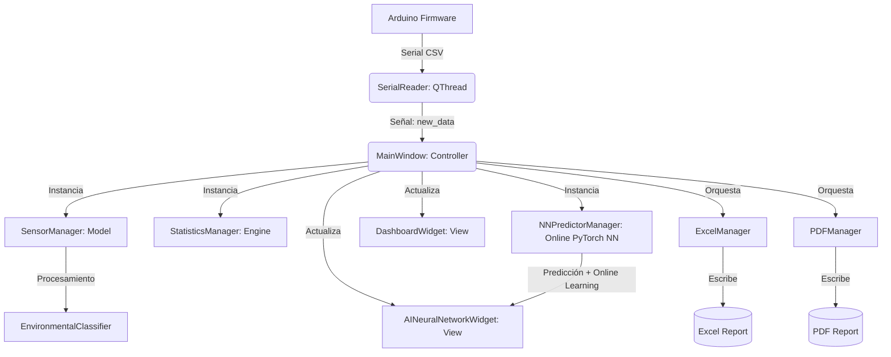

# SIMA — Sistema Inteligente de Monitoreo Ambiental

SIMA es una solución de grado industrial y producción para la adquisición, clasificación y reporte de variables microambientales (Temperatura y Humedad Relativa). Está diseñado bajo una arquitectura robusta de bajo acoplamiento que implementa **MVVM (Model-View-ViewModel)** en el lado del Host (Python/PySide6) y comunicación en tiempo real con hardware microcontrolado (Arduino UNO).

---

## 📐 1. Arquitectura de Software

El sistema sigue una jerarquía desacoplada mediante Señales/Slots para evitar bloqueos del hilo principal del renderizado visual (UI):



---

## 🧠 Red Neuronal Predictiva y Asistente IA (Nuevo)

SIMA cuenta con un motor de **Red Neuronal Multicapa (MLP)** implementado en PyTorch (con fallback en NumPy) para aprendizaje continuo en tiempo real (*Online Learning*):
- **Aprendizaje Continuo ("Cuanto más datos toma, más inteligente se vuelve"):** La red se retropropaga automáticamente con cada lectura entrante de los sensores, ajustando sus pesos gradualmente para minimizar el Error Cuadrático Medio (MSE).
- **Predicción a Futuro:** Genera pronósticos autoregresivos multi-paso (+1 min y +5 min) para anticipar variaciones de temperatura y humedad ambiental.
- **Pestaña dedicada "🧠 Red Neuronal & IA":** Permite visualizar la curva de convergencia del error MSE, la comparación en vivo entre datos reales y predichos, así como interactuar con un Asistente Diagnóstico IA.
- **Preparado para Agentes Conversacionales (LLM):** La arquitectura expone la interfaz `get_ai_agent_summary()` que servirá como función/herramienta para la futura IA conversacional del sistema.

---

## 🔌 2. Conexiones y Diseño del Hardware

### Componentes Utilizados
1. **Microcontrolador:** Arduino UNO R3 (o similar compatible).
2. **Sensor:** DHT11 (Sensor digital de humedad y temperatura).
3. **Resistencia de Pull-Up:** $4.7\text{ k}\Omega$ a $10\text{ k}\Omega$ (sólo requerida si el módulo DHT11 no viene integrado en placa de desarrollo).
4. **Conexión Host:** Cable USB Tipo A a Tipo B.

### Diagrama de Conexión del Pinout (Esquema de Instrumentación)
```text
  [ DHT11 Sensor ]              [ Arduino UNO ]
    +-------------+               +-------------+
    |   Pin VCC   | <-----------> |    Pin 5V   |
    |   Pin DATA  | <-----------> |  Pin D4 (E/S|
    |   Pin NC    | (No Conectar) |             |
    |   Pin GND   | <-----------> |   Pin GND   |
    +-------------+               +-------------+
           |
           +-- [ Resistencia Pull-Up 10k ] --+
           |                                 |
         (DATA)                            (VCC)
```
> [!IMPORTANT]
> Si utiliza un sensor DHT11 básico de 4 pines suelto, es mandatorio colocar la resistencia de pull-up entre el pin VCC y el pin de DATA para mantener el bus de datos en estado alto por defecto. Si utiliza el módulo DHT11 con PCB integrado de 3 pines, este ya incorpora la resistencia.

---

## 💻 3. Instrucciones de Instalación y Despliegue

### Requisitos del Sistema
* **SO:** Linux Mint 21+ (o cualquier distribución Linux compatible con Python 3.10+).
* **Python:** Python 3.12 o superior.
* **Arduino IDE:** Versión 2.x (para compilación y carga del firmware).

### Paso 1: Configurar el Entorno Virtual (Venv) e Instalar Dependencias
En la terminal de Linux Mint, ejecute los siguientes comandos desde la carpeta raíz del proyecto:

```bash
# Crear el entorno virtual
python3 -m venv .venv

# Activar el entorno
source .venv/bin/activate

# Instalar dependencias requeridas congeladas
pip install -r requirements.txt
```

### Paso 2: Configurar Permisos de Acceso Serial
Por defecto, Linux restringe el acceso directo al puerto USB serial `/dev/ttyUSB*` o `/dev/ttyACM*`. Conceda permisos a su usuario agregándolo al grupo `dialout`:

```bash
sudo usermod -a -G dialout $USER
```
> [!NOTE]
> Debe cerrar sesión de usuario en Linux Mint y volver a iniciarla para que el cambio de grupo de permisos se aplique de forma efectiva.

---

## 🚀 4. Guía de Ejecución y Carga del Firmware

### Carga del Firmware Arduino
1. Abra el IDE de Arduino 2.x.
2. Abra el archivo `trabajo.ino` localizado en la carpeta del proyecto.
3. Conecte su placa Arduino UNO mediante USB.
4. En el IDE, seleccione la placa **Arduino Uno** y el puerto serial correspondiente (ej: `/dev/ttyUSB0` o `/dev/ttyACM0`).
5. Haga clic en **Cargar (Upload)**.
6. Verifique que el LED de la placa parpadee rápidamente durante la escritura.

### Lanzar la Aplicación Python
Asegurando que el entorno virtual `.venv` esté activo en la terminal, ejecute:

```bash
python3 main.py
```

---

## 📊 5. Guía de Uso del Software SIMA

1. **Establecer Comunicación:**
   * Al iniciar, la aplicación cargará el puerto por defecto.
   * Haga clic en **Conectar Serial**. El indicador LED cambiará de **Rojo (Desconectado)** a **Verde (Conectado)**.
   * Si la placa se reinicia, el LED pasará temporalmente a **Naranja (Estabilizando)** mientras el sensor DHT11 inicia su secuencia (3 segundos).

2. **Panel de Control de Visualización:**
   * Las tarjetas mostrarán la temperatura y humedad actual con códigos de color de advertencia (Amarillo: Cálido, Azul: Frío, Verde: Excelente).
   * Los diales circulares de progreso dibujarán el nivel actual en base a los límites físicos del instrumento.
   * Las gráficas de pyqtgraph trazarán la curva temporal de forma continua. Puede usar el botón de scroll del mouse sobre la gráfica para hacer zoom dinámico y el botón de arrastre para paneo.

3. **Exportación de Reportes de Calidad:**
   * **Exportar Excel:** Guarda en `excel/` un documento con dos pestañas (Resumen estadístico del periodo y el Historial crudo indexado).
   * **Generar PDF:** Genera un informe corporativo elegante en `reports/` compilado con portada, gráficas insertadas y un bloque de **conclusiones heurísticas automáticas** en base al promedio de las lecturas.

4. **Menú de Configuración:**
   * El botón **Configuración** abre un panel interactivo que detecta en tiempo real los puertos seriales activos del sistema, permite cambiar la velocidad de transmisión (Baudios), las rutas de guardado de los reportes y alternar dinásticamente el **Tema Visual** (Oscuro/Claro) sin necesidad de reiniciar el programa.
