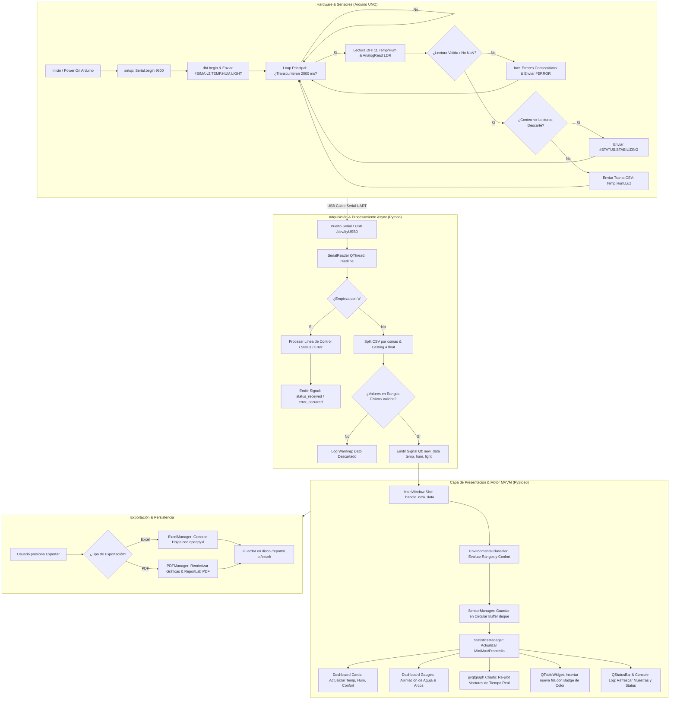
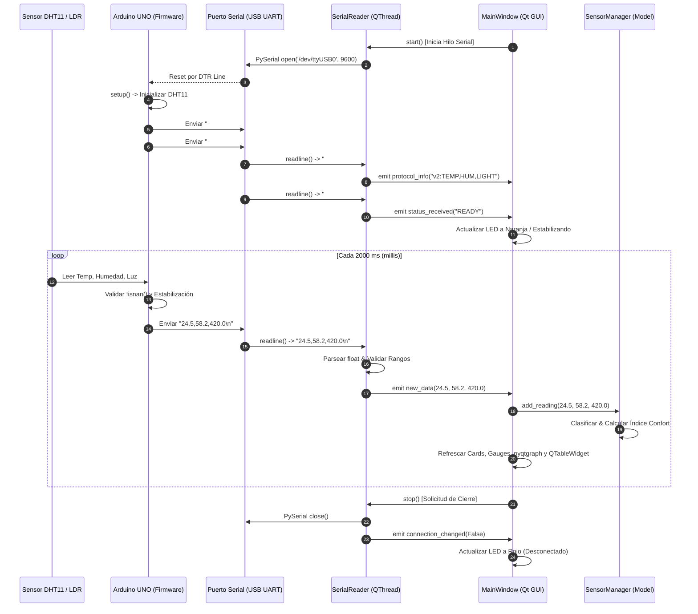
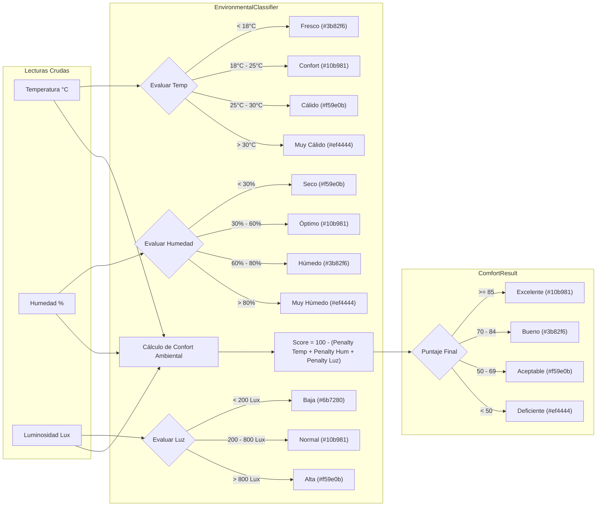
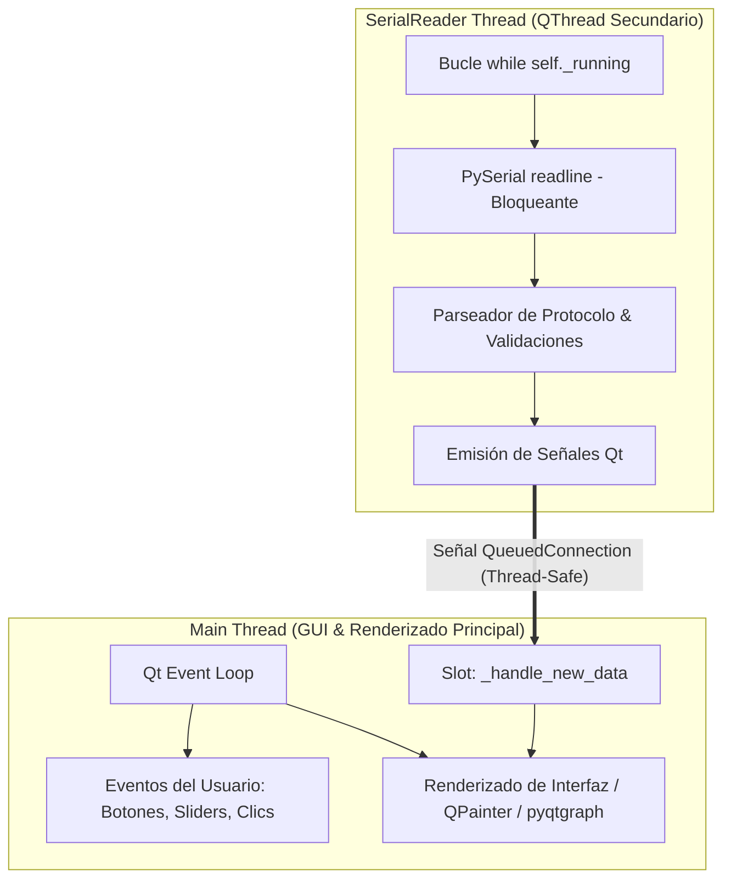
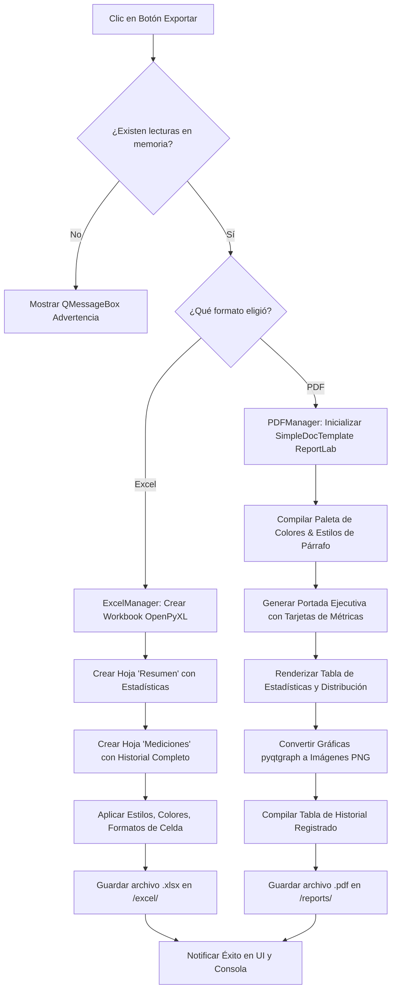

# 🛰️ SIMA — Arquitectura del Sistema, Esquema de Comunicación y Diagramas de Flujo

> **Sistema Inteligente de Monitoreo Ambiental (SIMA)**  
> Documento de Especificación Técnica de Arquitectura, Flujo de Datos y Protocolos de Comunicación.

---

## 📋 Tabla de Contenidos
1. [Visión General de la Arquitectura de Capas](#1-visión-general-de-la-arquitectura-de-capas)
2. [Esquema Integral del Sistema Completo (Bloques y Conexiones)](#2-esquema-integral-del-sistema-completo-bloques-y-conexiones)
3. [Diagramas de Flujo del Sistema (Mermaid)](#3-diagramas-de-flujo-del-sistema-mermaid)
   - [3.1 Diagrama de Flujo General End-to-End (E2E)](#31-diagrama-de-flujo-general-end-to-end-e2e)
   - [3.2 Diagrama de Secuencia de Comunicación Hardware ↔ Software](#32-diagrama-de-secuencia-de-comunicación-hardware--software)
   - [3.3 Diagrama de Flujo del Motor de Clasificación e Índice de Confort](#33-diagrama-de-flujo-del-motor-de-clasificación-e-índice-de-confort)
   - [3.4 Diagrama de Arquitectura Multihilo (QThread vs Qt GUI Loop)](#34-diagrama-de-arquitectura-multihilo-qthread-vs-qt-gui-loop)
   - [3.5 Diagrama de Flujo de Exportación (PDF y Excel)](#35-diagrama-de-flujo-de-exportación-pdf-y-excel)
4. [Especificación del Protocolo de Comunicación SIMA](#4-especificación-del-protocolo-de-comunicación-sima)
5. [Desglose Componente por Componente](#5-desglose-componente-por-componente)
6. [Esquema Electrónico de Conexiones Hardware](#6-esquema-electrónico-de-conexiones-hardware)

---

## 1. Visión General de la Arquitectura de Capas

El proyecto **SIMA** está diseñado bajo un patrón de **Arquitectura Desacoplada por Capas (Layered Architecture)** combinado con el patrón de diseño **MVVM (Model-View-ViewModel)** orientado a eventos en el cliente Python.

```
+-----------------------------------------------------------------------+
|                       1. CAPA DE HARDWARE / SENSORES                  |
|          [DHT11 Temp/Hum]        [LDR Fotorresistencia Lux]           |
+-----------------------------------++----------------------------------+
                                    || (Señales Analógicas / Digitales)
                                    v
+-----------------------------------------------------------------------+
|                      2. CAPA DE FIRMWARE (ARDUINO UNO)                |
|       Lectura no bloqueante (millis) -> Formateador CSV / Protocolo    |
+-----------------------------------++----------------------------------+
                                    || (USB / UART Serial @ 9600 Baud)
                                    v
+-----------------------------------------------------------------------+
|                 3. CAPA DE ADQUISICIÓN SERIAL (QThread)               |
|      SerialReader QThread -> Parseo defensivo -> Emisión de Signals   |
+-----------------------------------++----------------------------------+
                                    || (Qt Signals: new_data, status)
                                    v
+-----------------------------------------------------------------------+
|               4. CAPA DE MODELO Y CLASIFICACIÓN (MVVM Model)          |
|   SensorManager (Buffer Circular) | EnvironmentalClassifier | Stats    |
+-----------------------------------++----------------------------------+
                                    || (Actualización del Estado)
                                    v
+-----------------------------------------------------------------------+
|                 5. CAPA DE PRESENTACIÓN / GUI (PySide6)               |
|   MainWindow | DashboardWidget | Gauges | Cards | pyqtgraph Charts    |
+-----------------------------------++----------------------------------+
                                    || (Acción del Usuario: Exportar)
                                    v
+-----------------------------------------------------------------------+
|                 6. CAPA DE PERSISTENCIA Y REPORTES                    |
|       ExcelManager (openpyxl)     |      PDFManager (ReportLab)       |
+-----------------------------------------------------------------------+
```

---

## 2. Esquema Integral del Sistema Completo (Bloques y Conexiones)

El siguiente esquema en ASCII representa la totalidad de las interacciones, componentes y flujos de información del sistema SIMA:

```
========================================================================================================================
                                       ESQUEMA GENERAL DEL SISTEMA SIMA
========================================================================================================================

 HARDWARE (NODO EMISOR)                         PC HOST (APLICACIÓN PYTHON PYSIDE6)
+------------------------+                     +-----------------------------------------------------------------------+
|  ENTORNO AMBIENTAL     |                     |                                                                       |
| (Temperatura, Humedad, |                     |  +-----------------------------------------------------------------+  |
|      Luminosidad)      |                     |  |                    MAIN THREAD (Qt Event Loop)                  |  |
+-----------+------------+                     |  |                                                                 |  |
            |                                  |  |  +-----------------------------------------------------------+  |  |
            v                                  |  |  |                    gui/mainwindow.py                      |  |  |
+------------------------+                     |  |  |   - Orquestador del ciclo de vida                            |  |  |
|  SENSORES FISICOS      |                     |  |  |   - Captura señales de SerialReader via Slots Qt          |  |  |
|  - DHT11 (Pin D4)      |                     |  |  +-----------------------------+-----------------------------+  |  |
|  - LDR (Pin A0)        |                     |  |                                |                                |  |
+-----------+------------+                     |  |                                v                                |  |
            | Lecturas                         |  |  +-----------------------------------------------------------+  |  |
            v                                  |  |  |                   gui/dashboard.py                        |  |  |
+------------------------+                     |  |  |  - DashboardWidget (Contenedor Principal)                |  |  |
|  ARDUINO UNO (ATmega)  |                     |  |  |  - Cards (Tarjetas de métricas rápidas)                   |  |  |
|  firmware: trabajo.ino |                     |  |  |  - Gauges (Indicadores circulares tipo SCADA)              |  |  |
|  - Temporizador millis()|                    |  |  |  - pyqtgraph Charts (Gráficas vectoriales en tiempo real)|  |  |
|  - Descarte inicial    |                     |  |  |  - QTableWidget (Historial de mediciones)                |  |  |
|  - Control de Errores  |                     |  |  |  - LogConsole (Consola de eventos de sistema)            |  |  |
+-----------+------------+                     |  |  +-----------------------------+-----------------------------+  |  |
            |                                  |  |                                |                                |  |
            | Tramas ASCII / CSV               |  |                                v                                |  |
            |  "24.5,60.2,450.0\n"             |  |  +-----------------------------------------------------------+  |  |
            |  "#STATUS:STABLE\n"              |  |  |                CAPA DE MODELO Y LÓGICA                    |  |  |
            |                                  |  |  |  - sensor_manager.py  (Deque circular & Memory Store)   |  |  |
            v                                  |  |  |  - classification.py (Clasificador fuzzy / Rangos)      |  |  |
    +---------------+                          |  |  |  - statistics_manager.py (Min, Max, Promedio, Desv)     |  |  |
    | PUERTO SERIAL |                          |  |  |  - settings_manager.py (Persistencia JSON de App)       |  |  |
    | USB / /dev/tty|                          |  |  +-----------------------------+-----------------------------+  |  |
    +-------+-------+                          |  |                                |                                |  |
            |                                  |  |                                v                                |  |
            | PySerial                         |  |  +-----------------------------------------------------------+  |  |
            v                                  |  |  |                CAPA DE REPORTES Y GENERACIÓN             |  |  |
+------------------------+                     |  |  |  - excel_manager.py (Libro de trabajo OpenPyXL)         |  |  |
|  serial_reader.py      |                     |  |  |  - pdf_manager.py   (ReportLab Executive PDF + Charts)   |  |  |
|  (QThread Dedicado)    |                     |  |  +-----------------------------------------------------------+  |  |
|  - Lectura asíncrona   |                     |  +-----------------------------------------------------------------+  |
|  - Filtro defensivo    |                     |                                                                       |
|  - Reconexión auto     |                     |                                                                       |
+-----------+------------+                     |                                                                       |
            | Emite Qt Signals                 |                                                                       |
            +----------------------------------+-----------------------------------------------------------------------+
               new_data(temp, hum, light)
               status_received(msg)
               error_occurred(err)
========================================================================================================================
```

---

## 3. Diagramas de Flujo del Sistema (Mermaid)

### 3.1 Diagrama de Flujo General End-to-End (E2E)

Este diagrama describe todo el recorrido del dato desde el fenómeno físico en los sensores hasta su representación en la interfaz visual y exportación final.



---

### 3.2 Diagrama de Secuencia de Comunicación Hardware ↔ Software

El siguiente diagrama de secuencia visualiza la sincronización temporal y el protocolo de handshake entre Arduino y el cliente PySide6:



---

### 3.3 Diagrama de Flujo del Motor de Clasificación e Índice de Confort

Este esquema muestra cómo el módulo `classification.py` procesa los datos crudos entrantes para asignar categorías cualitativas y calcular el índice de confort general.



---

### 3.4 Diagrama de Arquitectura Multihilo (QThread vs Qt GUI Loop)

Garantizar una interfaz de usuario fluida (60 FPS sin congelamientos) requiere aislar la lectura del puerto serial de I/O en un hilo secundario mediante **QThread**:



---

### 3.5 Diagrama de Flujo de Exportación (PDF y Excel)



---

## 4. Especificación del Protocolo de Comunicación SIMA

El protocolo de comunicación SIMA opera sobre un enlace serie asíncrono (UART) a **9600 Baudios, 8 bits de datos, sin paridad y 1 bit de parada (8N1)**.

### Tipos de Tramas Transmitidas por Arduino:

| Tipo de Trama | Prefijo | Ejemplo de Formato | Descripción |
| :--- | :--- | :--- | :--- |
| **Cabecera de Protocolo** | `#SIMA:` | `#SIMA:v2:TEMP,HUM,LIGHT\n` | Enviado al inicio. Indica la versión y los campos transmitidos. |
| **Mensaje de Estado** | `#STATUS:` | `#STATUS:STABLE\n` | Comunica cambios de estado (`READY`, `STABILIZING`, `STABLE`). |
| **Mensaje de Error** | `#ERROR:` | `#ERROR:DHT11_READ_FAIL\n` | Alerta sobre fallos de hardware o lecturas inválidas. |
| **Lectura de Datos** | *Sin `#`* | `24.5,60.2,450.0\n` | Trama de datos en formato **CSV** (Temperatura, Humedad, Luz). |

---

## 5. Desglose Componente por Componente

### 1. `trabajo.ino` (Firmware Arduino)
- **Función**: Nodo sensor embebido.
- **Temporización**: Uso estricto de `millis()` (sin `delay()`) con intervalo de 2000 ms.
- **Resiliencia**:
  - Descarta las primeras 2 lecturas inestables tras el encendido.
  - Mantiene un contador de errores consecutivos. Si supera 5 errores, emite alerta por serial y enciende el LED integrado (`LED_BUILTIN`).

### 2. `serial_reader.py` (Lector Serial Multihilo)
- **Herencia**: `QThread`.
- **Funcionalidades**:
  - Ejecuta el bucle I/O sin bloquear la interfaz de usuario.
  - Filtra caracteres corruptos (`UnicodeDecodeError`).
  - Aplica un filtro de validación física de rangos (-10°C a 60°C; 0% a 100% Humedad).
  - Gestiona reconexión automática en caso de desconexión del cable USB.

### 3. `sensor_manager.py` (Modelo de Datos)
- **Estructura**: `deque(maxlen=100)` para buffer circular en gráficas + `list` completa para exportación.
- **Thread Safety**: Uso de `threading.Lock()` para garantizar lecturas y escrituras seguras entre hilos.

### 4. `classification.py` (Motor de Clasificación Fuzzy & Confort)
- **Categorización**: Divide los valores numéricos en etiquetas cualitativas con colores Hexadecimales asociados.
- **Índice de Confort**: Algoritmo ponderado de penalización que evalúa la desviación respecto a las zonas ideales de confort humano (21°C - 24°C y 40% - 50% Humedad).

### 5. `gui/mainwindow.py` & `gui/dashboard.py` (Capa de Presentación)
- **Vistas Incluidas**:
  - `Cards`: Tarjetas dinámicas con badges de estado.
  - `Gauges`: Indicadores vectoriales renderizados con `QPainter`.
  - `pyqtgraph Charts`: Gráficas de altísimo rendimiento aceleradas para series de tiempo.
  - `QTableWidget`: Tabla formateada en tiempo real.
  - `LogConsole`: Consola de eventos del sistema.

### 6. `excel_manager.py` & `pdf_manager.py` (Persistencia & Reportes)
- Generación de reportes ejecutivos en formato **Excel (.xlsx)** y **PDF (.pdf)** profesionales con tablas de resumen, estadísticas descriptivas (min, max, media, desviación estándar) e historial filtrado.

---

## 6. Esquema Electrónico de Conexiones Hardware

```
                      +-------------------+
                      |   ARDUINO UNO     |
                      |                   |
                      |              5V   +-----> VCC (DHT11 & LDR)
                      |             GND   +-----> GND (DHT11 & LDR)
                      |                   |
   DHT11 Sensor       |                   |
  +------------+      |                   |
  | VCC        +------+                   |
  | DATA (S)   +----->| Pin Digital 4     |
  | GND        +------+                   |
  +------------+      |                   |
                      |                   |
   Fotorresistencia   |                   |
   LDR + Resistencia  |                   |
  +------------+      |                   |
  | VCC        +------+                   |
  | Signal (S) +----->| Pin Analógico A0  |
  | GND (10kΩ) +------+                   |
  +------------+      +---------+---------+
                                |
                                | Cable USB Tipo B (Serial UART @ 9600)
                                v
                      +-------------------+
                      | PC HOST (PYTHON)  |
                      +-------------------+
```

---

> **SIMA Framework v2.0** — Diseñado y desarrollado con estándares de calidad industrial SCADA.
